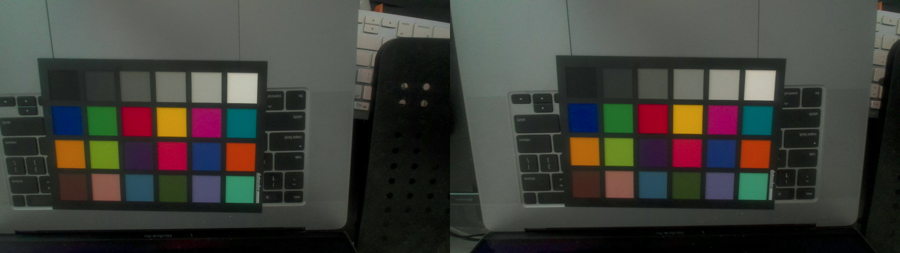

<a href="https://www.buymeacoffee.com/raleighlittles" target="_blank"></a>

# About

This tool is used to install firmware onto a Playstation camera. The supported models are listed below.

| Model number | Console |
|--------------|---------|
| CUH-ZEY1     | [PS4](./docs/ps4-camera-image.jpg)     |
| CFI-ZEY1     | [PS5](./docs/ps5-camera-image.jpg)     |

The PlayStation 2 camera (["EyeToy"/SLEH-0003x variants](./docs/ps2-camera-image.jpg)) and PlayStation 3 camera (["PlayStation Eye"/SLEH-00448](.docs/ps3-camera-image.png)) use UVC drivers by default, and do not have the ability to program firmware over USB.

The main reason why you'd want to load custom firmware onto the camera is to be able to use it as a [UVC device](https://en.wikipedia.org/wiki/USB_video_device_class), i.e. a webcam.

This is a Linux port of [OrbisEyeCam](https://github.com/psxdev/OrbisEyeCam) for Windows. Kudos to @psxdev for the initial effort of reverse-engineering.

# Webcam setup

To use this as a webcam, we need to install custom firmware onto the device (the default firmware doesn't support UVC).

You can find custom firmware for the Playstation camera on Github, here's a few that I've used:

* <https://github.com/prosperodev/hdcamera/blob/main/firmware/21.01-03.20.00.04-00.00.00.bin>
* <https://github.com/Hackinside/PS5_camera_files/blob/main/firmware.bin>

(Many more firmware versions are available [here](https://github.com/psxdev/luke_firmwares))

## Connect device

Connect your PS camera to a USB 3.0 port on your computer. (If you have a PS4 camera, you need to purchase an [AUX to USB adapter](https://www.amazon.com/dp/B09NTM46ND))

Make sure you see the following in the dmesg log:

```
 usb 2-4.4.4.4: new SuperSpeed Gen 1 USB device number 7 using xhci_hcd
 usb 2-4.4.4.4: New USB device found, idVendor=05a9, idProduct=0580, bcdDevice= 1.00
 usb 2-4.4.4.4: New USB device strings: Mfr=1, Product=2, SerialNumber=0
 usb 2-4.4.4.4: Product: USB Boot
 usb 2-4.4.4.4: Manufacturer: OmniVision Technologies, Inc.
```

Keep the dmesg window open, we'll need it for later.

## Setup permissions

[libusb](https://libusb.info/) needs permissions to be able to write to USB devices.

0. Make sure your user is part of the `plugdev` group. Easiest way to do this is to check your `/etc/group` file. If you're not in the plugdev group, run:

```bash
$ sudo usermod -a -G plugdev $USER
```

1. Copy the udev rules (`100-playstation-camera.rules`) to `/etc/udev/rules.d`

2. Reload the udev rules by running:

```bash
$ sudo udevadm control --reload ; sudo udevadm trigger
```

## Run the script

To build & run:

```bash
$ cargo build --manifest-path=Cargo.toml
$ ./target/debug/ps5_camera_firmware_loader <firmware-file-path>
```

## Success  :heavy_check_mark:

Go back to the dmesg window from earlier. You should see the following line:

```
uvcvideo: Found UVC 1.00 device USB Camera-OV580 (05a9:058c)
```

Open your favorite webcam program and now you're all set. Note that you must **reinstall the firmware every time the device power cycles**.

To have the firmware automatically installed at startup time, you can use this repository: https://github.com/viecili/ps5cam-firmware-loader-service

Here's a test image from the PS5 camera:



If you're using the firmware that I linked to above, then these are the formats and parameters it supports:

```
User Controls

                     brightness 0x00980900 (int)    : min=0 max=8 step=1 default=4 value=4
                       contrast 0x00980901 (int)    : min=0 max=8 step=1 default=4 value=4
                     saturation 0x00980902 (int)    : min=0 max=8 step=1 default=4 value=4
                            hue 0x00980903 (int)    : min=0 max=11 step=1 default=0 value=0
        white_balance_automatic 0x0098090c (bool)   : default=1 value=1
                           gain 0x00980913 (int)    : min=0 max=8 step=1 default=4 value=4
           power_line_frequency 0x00980918 (menu)   : min=0 max=2 default=1 value=1 (50 Hz)
      white_balance_temperature 0x0098091a (int)    : min=2800 max=6500 step=100 default=4600 value=4600 flags=inactive
                      sharpness 0x0098091b (int)    : min=0 max=8 step=1 default=4 value=4

Camera Controls

                  auto_exposure 0x009a0901 (menu)   : min=0 max=3 default=2 value=2 (Shutter Priority Mode)
         exposure_time_absolute 0x009a0902 (int)    : min=1 max=5000 step=1 default=1000 value=1000 flags=inactive

ioctl: VIDIOC_ENUM_FMT
 Type: Video Capture

 [0]: 'YUYV' (YUYV 4:2:2)
  Size: Discrete 896x256
   Interval: Discrete 0.008s (120.000 fps)
  Size: Discrete 1920x1080
   Interval: Discrete 0.033s (30.000 fps)
   Interval: Discrete 0.067s (15.000 fps)
   Interval: Discrete 0.125s (8.000 fps)
  Size: Discrete 960x520
   Interval: Discrete 0.017s (60.000 fps)
  Size: Discrete 448x256
   Interval: Discrete 0.008s (120.000 fps)
  Size: Discrete 1280x800
   Interval: Discrete 0.017s (60.000 fps)
   Interval: Discrete 0.033s (30.000 fps)
   Interval: Discrete 0.067s (15.000 fps)
   Interval: Discrete 0.125s (8.000 fps)
  Size: Discrete 640x376
   Interval: Discrete 0.008s (120.000 fps)
  Size: Discrete 320x184
   Interval: Discrete 0.004s (240.004 fps)
  Size: Discrete 5148x1088
   Interval: Discrete 0.033s (30.000 fps)
   Interval: Discrete 0.067s (15.000 fps)
   Interval: Discrete 0.125s (8.000 fps)
  Size: Discrete 3840x1080
   Interval: Discrete 0.033s (30.000 fps)
   Interval: Discrete 0.067s (15.000 fps)
   Interval: Discrete 0.125s (8.000 fps)
  Size: Discrete 1920x520
   Interval: Discrete 0.017s (60.000 fps)
  Size: Discrete 2560x800
   Interval: Discrete 0.017s (60.000 fps)
   Interval: Discrete 0.033s (30.000 fps)
   Interval: Discrete 0.067s (15.000 fps)
   Interval: Discrete 0.125s (8.000 fps)
  Size: Discrete 1280x376
   Interval: Discrete 0.008s (120.000 fps)
  Size: Discrete 640x184
   Interval: Discrete 0.004s (240.004 fps)
```

# Troubleshooting

## The UVC device is recognized, but all I see is a black screen

Try turning down the frame rate. I've noticed that sometimes the auto-exposure control doesn't seem to work.

## My PS5 won't recognize my camera anymore

Try doing a full reboot (not just rest mode) of your PS5, and then plugging in your camera.
